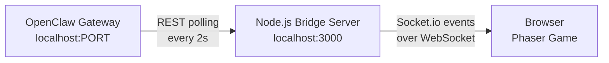
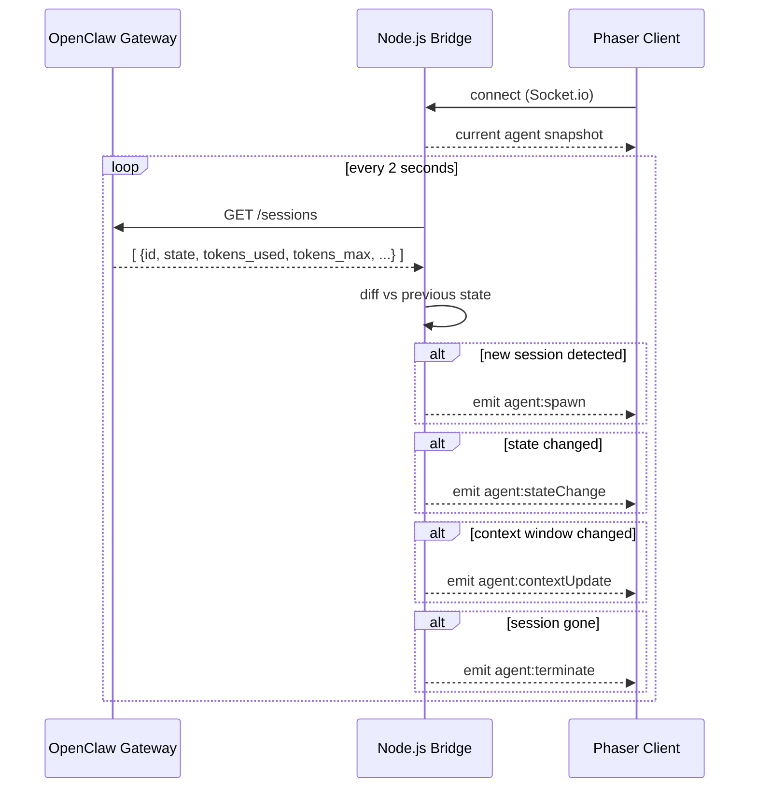
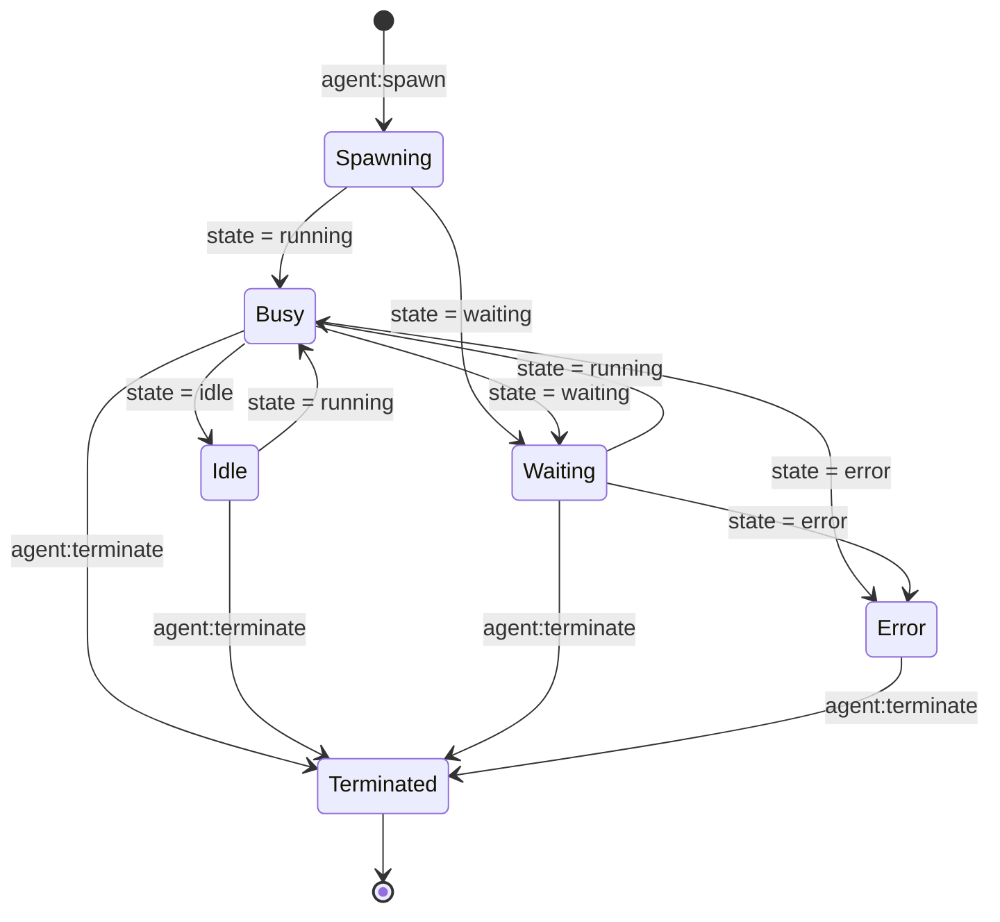

# OpenClaw Polling — Technical Concept

How to connect a Node.js / Phaser / Socket.io web app to a local OpenClaw instance for real-time agent state.

---

## High-Level Architecture



The browser never talks to OpenClaw directly. The Node.js bridge is the single connection point — it polls OpenClaw, diffs the state, and forwards only meaningful changes to connected clients.

---

## Data Flow in Detail



---

## OpenClaw API Discovery

Before writing any code, inspect what your local instance actually exposes:

```bash
# Get the full OpenAPI spec
curl http://localhost:<PORT>/api-reference/openapi.json | jq .paths

# Quick health check
curl http://localhost:<PORT>/health

# List active sessions
curl http://localhost:<PORT>/sessions
```

Key fields to look for in the response:
- Session/agent ID
- Execution state (`running`, `idle`, `waiting`, `error`, or equivalent)
- Token usage + token limit (for context window fill %)
- Timestamps (for session age and uptime)

---

## Node.js Bridge Server

```js
// server.js
import express from 'express'
import { createServer } from 'http'
import { Server } from 'socket.io'

const app = express()
const httpServer = createServer(app)
const io = new Server(httpServer, { cors: { origin: '*' } })

const OPENCLAW_URL = process.env.OPENCLAW_URL ?? 'http://localhost:8080'
const POLL_INTERVAL_MS = 2000

let agentStates = {}  // { [sessionId]: AgentState }

async function pollOpenClaw() {
  let sessions
  try {
    sessions = await fetch(`${OPENCLAW_URL}/sessions`).then(r => r.json())
  } catch (err) {
    console.error('OpenClaw unreachable:', err.message)
    return
  }

  const next = {}
  for (const session of sessions) {
    next[session.id] = {
      id: session.id,
      state: session.state,                               // 'running' | 'idle' | 'waiting' | 'error'
      contextFill: session.tokens_used / session.tokens_max,  // 0.0 – 1.0
      toolCallsPerMin: session.tool_calls_per_min ?? 0,
      age: Date.now() - new Date(session.started_at).getTime(),
    }
  }

  // New agents
  for (const [id, agent] of Object.entries(next)) {
    if (!agentStates[id]) {
      io.emit('agent:spawn', agent)
    }
  }

  // Changed agents
  for (const [id, agent] of Object.entries(next)) {
    const prev = agentStates[id]
    if (!prev) continue
    if (prev.state !== agent.state) {
      io.emit('agent:stateChange', agent)
    }
    if (Math.abs(prev.contextFill - agent.contextFill) > 0.01) {
      io.emit('agent:contextUpdate', agent)
    }
  }

  // Terminated agents
  for (const id of Object.keys(agentStates)) {
    if (!next[id]) {
      io.emit('agent:terminate', { id })
    }
  }

  agentStates = next
}

// Send current snapshot to a newly connected client
io.on('connection', (socket) => {
  socket.emit('agent:snapshot', Object.values(agentStates))
})

setInterval(pollOpenClaw, POLL_INTERVAL_MS)
pollOpenClaw() // immediate first run

httpServer.listen(3000, () => console.log('Bridge running on :3000'))
```

---

## Phaser Client — Socket.io Integration

```js
// Inside your Phaser Scene (e.g. GameScene.js)
import { io } from 'socket.io-client'

export class GameScene extends Phaser.Scene {
  create() {
    this.agents = {}  // { [id]: PhaserCharacter }
    const socket = io('http://localhost:3000')

    // Restore state on reconnect
    socket.on('agent:snapshot', (agents) => {
      agents.forEach(agent => this.spawnCharacter(agent))
    })

    socket.on('agent:spawn',         (agent) => this.spawnCharacter(agent))
    socket.on('agent:stateChange',   (agent) => this.setCharacterState(agent.id, agent.state))
    socket.on('agent:contextUpdate', (agent) => this.updateStress(agent.id, agent.contextFill))
    socket.on('agent:terminate',     ({ id }) => this.despawnCharacter(id))
  }

  spawnCharacter(agent) { /* walk-in animation, assign desk position */ }
  setCharacterState(id, state) { /* switch animation: typing / sleeping / waiting / slumped */ }
  updateStress(id, fill) { /* grow paper pile, update gauge, trigger sweat sprite at >0.8 */ }
  despawnCharacter(id) { /* wave + fade, free desk slot */ }
}
```

---

## State → Visual Mapping



| OpenClaw State | Socket.io Event | Phaser Animation |
|---|---|---|
| new session | `agent:spawn` | Character walks in, sits down |
| `running` | `agent:stateChange` | Typing loop, tabs flickering |
| `idle` | `agent:stateChange` | Head on keyboard, Zzz bubble |
| `waiting` | `agent:stateChange` | Leaning back, finger tapping |
| `error` | `agent:stateChange` | Slumped in chair, red desk light |
| context > 50% | `agent:contextUpdate` | Papers start appearing on desk |
| context > 80% | `agent:contextUpdate` | Desk buried, sweat drops |
| context > 95% | `agent:contextUpdate` | Papers flying, full panic mode |
| session ended | `agent:terminate` | Wave goodbye, desk goes dark |

---

## Stress Calculation

Context fill alone is not enough. Stress is a composite score used to drive visual intensity:

```js
function calcStress(agent) {
  const contextStress  = agent.contextFill                          // 0–1
  const activityStress = Math.min(agent.toolCallsPerMin / 20, 1)   // normalised, cap at 20/min
  const ageStress      = Math.min(agent.age / (1000 * 60 * 60), 1) // normalised, cap at 1 hour

  return (contextStress * 0.6) + (activityStress * 0.3) + (ageStress * 0.1)
}
```

| Stress | Visual State |
|---|---|
| 0.0 – 0.3 | Calm, normal speed |
| 0.3 – 0.6 | Typing faster, slight dishevel |
| 0.6 – 0.8 | Papers piling, sweat sprite |
| 0.8 – 1.0 | Full chaos — papers flying, gauge red |

---

## Project Structure

```
synthetic-talents-box/
├── server/
│   ├── server.js          # Express + Socket.io bridge
│   ├── poller.js          # OpenClaw polling logic
│   └── .env               # OPENCLAW_URL=http://localhost:PORT
└── client/
    ├── src/
    │   ├── scenes/
    │   │   └── GameScene.js   # Phaser scene, socket listeners
    │   ├── characters/
    │   │   └── AgentCharacter.js  # Sprite + animation state machine
    │   └── main.js
    └── index.html
```

---

## First Steps

1. **Discover the API** — curl your local OpenClaw instance, inspect `/api-reference/openapi.json`
2. **Adjust field names** in `poller.js` to match actual response shape
3. **Run the bridge** — `node server.js`, verify events appear in console
4. **Connect Phaser** — log socket events first, wire animations second
5. **Add mock mode** — hardcode a fake session list for offline dev/demo
