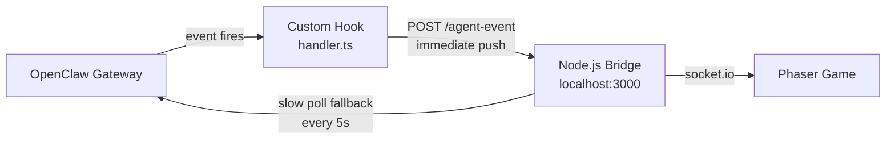
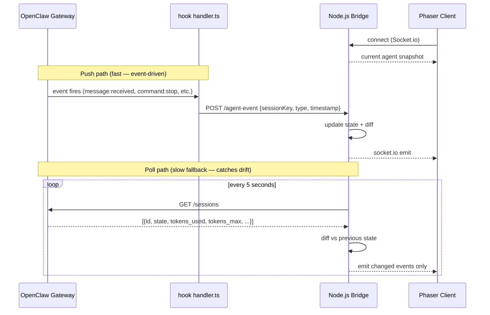

# OpenClaw — Push vs Poll Strategy

How to get real-time agent state updates from OpenClaw into the Node.js bridge, and why a hybrid approach is best.

---

## What OpenClaw Actually Supports

OpenClaw does **not** expose a native SSE or WebSocket stream for agent state. Three mechanisms exist:

| Mechanism | Direction | Useful for us? |
|---|---|---|
| `POST /hooks/wake`, `POST /hooks/agent` | External → OpenClaw | No — inbound only, triggers agent actions |
| **Internal Hook system** (`handler.ts`) | OpenClaw → our code | **Yes** — fires on session/message events |
| REST polling | Our code → OpenClaw | **Yes** — baseline fallback |

---

## Recommended: Hybrid Push + Poll

Use OpenClaw's **internal hook system** to push events to the bridge the moment they happen. Keep a **slow REST poll as a fallback** to catch anything hooks miss (idle drift, token accumulation between messages).



---

## Available Hook Events

OpenClaw fires these events that we can intercept:

| Event | Game meaning |
|---|---|
| `agent:bootstrap` | Session starting — spawn character at desk |
| `command:new` | New session created |
| `command:stop` | Session stopped — despawn character |
| `command:reset` | Session reset — restart character |
| `message:received` | Agent received input → switch to busy/typing |
| `message:sent` | Agent sent response → may go idle or waiting |
| `session:compact:before` | Context compaction starting — stress spike |
| `session:compact:after` | Compaction done — stress relief animation |

---

## Full Data Flow



---

## The OpenClaw Hook

Create a hook inside your OpenClaw config directory:

```
~/.openclaw/hooks/state-notifier/
├── HOOK.md        # metadata — which events to subscribe to
└── handler.ts     # the push logic
```

### HOOK.md

```markdown
# State Notifier Hook

Pushes agent state changes to the Synthetic Talents Box bridge.

events: ["agent:bootstrap", "command:new", "command:stop", "command:reset", "message:received", "message:sent", "session:compact:before", "session:compact:after"]
```

### handler.ts

```ts
export async function handler(event) {
  try {
    await fetch('http://localhost:3000/agent-event', {
      method: 'POST',
      headers: { 'content-type': 'application/json' },
      body: JSON.stringify({
        sessionKey: event.sessionKey,
        type: event.type,
        timestamp: event.timestamp,
      }),
    })
  } catch {
    // Bridge not running — silently ignore, poll will cover it
  }
}
```

---

## Bridge Server — Receiving Hook Events

Add a `/agent-event` endpoint to the existing Node.js bridge:

```js
app.use(express.json())

// Map OpenClaw hook event types to game states
const EVENT_TO_STATE = {
  'message:received':        'running',
  'message:sent':            'waiting',
  'agent:bootstrap':         'spawning',
  'command:new':             'spawning',
  'command:stop':            'terminated',
  'command:reset':           'spawning',
  'session:compact:before':  'compacting',
  'session:compact:after':   'running',
}

app.post('/agent-event', (req, res) => {
  const { sessionKey, type, timestamp } = req.body
  const state = EVENT_TO_STATE[type]

  if (state && agentStates[sessionKey]) {
    agentStates[sessionKey].state = state
    io.emit('agent:stateChange', { id: sessionKey, state, timestamp })
  }

  res.sendStatus(200)
})
```

---

## Why Keep the Poll at All?

Hooks only fire on discrete events. They won't tell you:
- That the context window crept up 5% between messages
- That a session has been quietly idle for 10 minutes
- That a session disappeared without a clean `command:stop`

The poll (every 5s instead of every 2s) catches all of this cheaply.

---

## Push vs Poll Comparison

| | Hook push | REST poll |
|---|---|---|
| Latency | Immediate | Up to 5s lag |
| State covered | Discrete events only | Full state snapshot |
| Context window % | No | Yes |
| Session disappearance | Only if clean stop | Yes (absence from list) |
| Setup effort | Requires hook install | Just HTTP calls |
| Works without config | No | Yes |

**Start with just polling** to get the game working. **Add hooks later** for snappier animations on message events.
